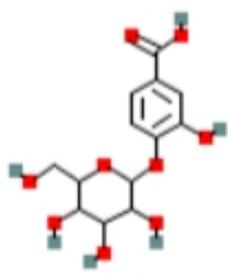
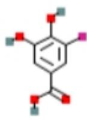

# Protocatechuic acid 4-O-glucoside; DTXSID301341731

Compound CID: 157010113

MF: C13H16O9 MW: 316.26 g/mol

IUPAC Name: 3- hydroxy- 4- [3,4,5- trihydroxy- 6- (hydroxymethyl)oxan- 2- yl]oxybenzoic acid

SMILES: C1=C(C=C(C=C1C(=O)O)O)OC2C(C(C(C(O2)CO)O)O)O

InChlKey: HFFREILXLCWCQH- UHFFFAOYSA- N

InChl: InChl=1S/C13H16O9/c14- 4- 8- 9(16)10(17)11(18)13(22- 8)21- 7- 2- 1- 5(12(19)20)3- 6(7)15/h1- 3,8- 11,13- 18H,4H2.(H,19,20)

Create Date: 2021- 11- 15

Summary

Similar Structures Search Related Records

5- fluoro- protocatechuic acid; SCHEMBL9787632

Compound CID: 15173704

MF: C7H5FO4 MW: 172.11 g/mol

IUPAC Name: 3- fluoro- 4,5- dihydroxybenzoic acid

SMILES: C1=C(C=C(C(=C1O)O)F)C(=O)O

InChlKey: RTYDIWLGIZQTKB- UHFFFAOYSA- N

InChl: InChl=1S/C7H5FO4/c8- 4- 1- 3(7(11)12)2- 5(9)6(4)10/h1- 2,9- 10H, (H,11,12)

Create Date: 2007- 02- 09

Summary

Similar Structures Search Related Records